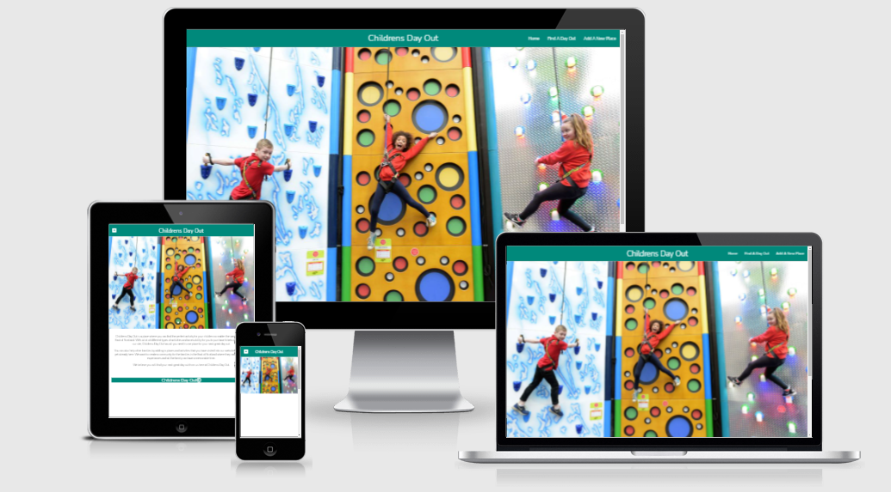

# Childrens Day Out Website

#### A link to the site can be found [here](https://kids-activities-project.herokuapp.com/)

#### Backend Development - Code Institute

## Table of Contents
1. [Introduction](#introduction)
2. [User Experience](#user-experience)
3. [Wireframes](#wireframes)
4. [Database Design](#design)
5. [Features](#features)
6. [Testing](#testing)
7. [Deployment](#deployment)
8. [Credits](#credits)

### Introduction
#### Childrens Day Out.com is a newly created website that provides places and activities for children and families in and around the East of Scotland. The site will provide detail on these places but also allow users to add places that they have visited that have not yet been documented on the site.

### User Experience

The website will be simple to navigate and hold enough information on the places and activities for the user to make a decision if this is somewhere they would like to visit. It will also allow them to go and purchase tickets for the activity, making the site the one place they need to look to for their day out.

User Stories to help achieve this user experience:

User:

1. As a user of the webiste, I want to view what places have been recommended to visit with my children.
2. As a user of the website, I want to have easy access to purchasing tickets for the place, if required.
3. As a user of the website, I want to be able to add and review places I have visited that my children enjoyed so other people are aware and can visit.

Site Owner:

1. As the owner of the website, I want to ensure it is easy to find places people can visit with their children but also bright and fun to look at for children.
2. As the owner of the website, as I have agreed a percentage of the tickets bought via accessing the places website via my site, I want the access to purchase tickets to be obvious to the user and simple to use.
3. As the owner of the website, I want users to have the ability to add places and recommendations for other to visit that are not already listed on the website.

### Wireframes

 - [Index Page](wireframes/index_page.png)
 - [Activity Page](wireframes/activity_page.png)
 - [Add Activity Page](wireframes/add_activity_page.png)
 - [Edit Activity Page](wireframes/edit_activity_page.png)

 The site did not deviate too much from the wireframes however during the build it was decided that the accordian design would not be as engaging and it was decided to use cards to display the activities which was more visually appealing.

### Database Design

#### MongoDB was used as the non-relational database for this project. 3 collections were added to contain the data required:
 - age_ranges. This contained the number of different age ranges that could be in included in each activity and used when users were selecting the age range when adding their own activity.
 - categories. This collection contained the categories for each type of activity. This value was also contained in the place_to_visit collection.
 - place_to_visit. This held all the data for each activity listed on the site and was used to pull the data for displaying this data on each card.

 Collections and fields documented [here.](wireframes/database_design.png)

### Features

Existing features:

 - The site opens up on the index page which contains a **carousel of 3 images** showing 3 of the activities or places listed on the website.
 - The Find a Day Out page has all the activities each shown on a **card with an image of the place**.
 - The activities are **ordered by the latest addition first**, to ensure the most up to date activities are at the top of the page.
 - The user can click on the card to **reveal details of the activity** and a **link to purchasing tickets**.
 - The form to add an activity has **drop down options** for Category and Age Range.

Features left to implement:

 - Add register and login functionality to have better control over edit and deletions.
 - Add confirmation message when deleting.
 - Add database validation.
 - Pagination so only a set number of activities are on each page.

#### Technologies Used

* HTML5
* CSS
* Javascript
* Python
* Flask
* Flask-PyMongo
* PyMongo
* [Fontawesome](https://fontawesome.com/)
    * Fontawesome is used to provide the icons that are displayed throughout.
* [Jquery](https://jquery.com/)
    * Jquery is used for the Javascript elements used within the project.
* [MaterializeCSS](https://materializecss.com/)
    * Materialize CSS was used to support the structure and the responsiveness of the site as well as some of the display elements.

### Testing

The following testing was performed to test functionality, browser compatibility, responsiveness and that the user stories documented above are fulfilled by the completed site.

#### Functionality

Test | Action | Expected Outcome | Test Outcome |
---- | ------ | ---------------- | ------------ |
 Indicators on the index.html page. | Clicking on each carousal indicator changed the image. | The image was changed to the next image in the list. | PASS
 NAV Menu Links | Selecting each of the NAV menu links from different pages | You would be redirected to the page selected in the menu. | PASS
 Card Reveal | Clicking on the activity name on each card. | Extra detail of the activity would appear on card. | PASS
 Form Validation | Enter values that did not meet the validation within the form field. | Form would highlight or notify that value was not valid. | PASS
 Adding a new activity | Adding details into the add form. | The form would be submitted and details from form displayed on Find a Day Out page. | PASS
 Editing an existing activity | Change a value on an existing activity on the edit form. | Thange would be applied and visible on the activity on the Find a Day Out page. | PASS

#### Browser Capability

The website and functionality has been tested on the following devices:
 - Iphone 6s
 - Ipad 5th Generation
 - Iphone 12
 - Samsung Galaxy A20

The website and functionality has been tested on the following browsers:
 - Chrome (version 88.0.4324.190)
 - Edge (version 88.0.705.81)
 - Safari (version 14.4.1)

#### Performance

Performance of the website was tested using the Lighthouse function as part of Google developer tools. It was tested for desktop and mobile performance. Test output below.

 - [Lighthouse Test Desktop](testing/desktop_performance_test.png)
 - [Lighthouse Test Mobile](testing/mobile_performance_test.png)

The results for the desktop were very good however for the performance for the mobile was not great. The results highlighted the potential for third party code slowing the performance down. The use of this code should be reviewed in the next iteration of the site.

#### Code Validation

The HTML, CSS and Javascript were validated by using the different tools below.

[HTML Validator](https://validator.w3.org/) - The results [before](testing/html_validator_results_before.png) and [after](testing/html_validator_results_after.png) were reviewed and response below:

Before:
1. As designed, no header required.
2. Removed H6 element and continued with p element.
3. Removed H6 element and continued with p element.
4. Removed H6 element and continued with p element.

After:
1. As designed, no header required.
2. As designed, no header required.

[CSS Validator](https://jigsaw.w3.org/css-validator/) - The [results](testing/css_validator_results.png) were reviewed and response below:

One amendment was required to change font-weight to bold rather than a number which was being used incorrectly.

The Javascript code was checked and no issues found.

The Python code was checked to ensure it was PEP8 compliant by using the [Python Validator.](http://pep8online.com/) The [before](testing/pep8_validator_before.png) results showed 9 errors which were:
 - 3 related to comments not including a space after the #.
 - 4 were the line was too long. This was corrected by moving to two lines.
 - 2 were the Flash message was too long. The message was amended to ensure it was within the line limit.

 After the above changes, no errors were found. Results [here.](testing/pep8_validator_after.png)

#### Responsiveness

The website and the user experiance is functioning well across the different screen sizes for the different devices. As well as using the options within Google Lighthouse, [Responsinator](http://www.responsinator.com/) was also used to test how the site would look and feel on the different sceen sizes. The title text on the cards would not always all be visible on mobile devices when used as landscape. All other visuals and usability are working well.

 - [Responsinator Android Device](testing/responsinator_android.png)
 - [Responsinator Ipad Device](testing/responsinator_ios.png)

#### User Stories Test

To ensure the website met the expectations set by the users and stakeholders listed previously, testing was performed against their criteria.

##### User

The website provides places and activities for children in an easy to use manner and makes it straight forward to get access to purchasing tickets for these places. Adding your own activity is simple and the result is viewable instantly.

##### Site Owner

The site is easy to navigate around with 3 main pages but bright and colourful for users to enjoy. The access to purchase tickets is clear for the activity the user is on with the rest of the site being intuitive.

#### Defects Found during testing:

1. Category and Age Range drop down menu's on the add form would not work at the same time.
 - A comma was added incorrectly after the categories code line which was then removed to resolve.

2. Age range added in form was not updating in the database.
 - Incorrect code in app.py file. It had age_range rather than age.

3. Card reveal would show the first collection in the database for each activity card.
 - The div element for that card was outside of the for loop.

### Deployment

This project is stored [GitPod]() and is hosted using [Heroku](https://kids-activities-project.herokuapp.com/).

#### Deploying to GitHub Pages

The website was deployed to GitHub pages via the below procedure:
1. Log into **GitHub**.
2. Locate and select the repository named [MarcJPH/Milestone-Project-3](https://github.com/MarcJPH/Milestone-Project-3).
3. Near the top of the page select the **Settings** menu option.
4. Select the **The GitHub Pages** menu option on the left hand side.
5. Under Source, change the drop-down menu where None is labelled to **Master Branch**.
6. This deploys the website and creates a link for the website in the GitHub pages section.

#### Running the Project Locally

To run the project locally you will have to clone it first. Follow the below steps to perform the clone:

1. Within **GitHub**, locate and select the repository named **MarcJPH/Milestone-Project-3**.
2. When within the main page of the repository, select the **Code** button which can be found above the list of files section.
3. Select the option of **"Clone with HTTPS"** and then select the copy button which is the clipboard icon.
4. Go to **Workspaces** within GitPod and select the location where you want to place the cloned directory.
5. In the terminal window, type **"git clone"** and then paste the url that was copied from the directory within GitHub. Then press **enter**.
6. Upon pressing enter, the local clone of the directory will be made.

#### Deploying to Heroku using Gitpod

To deploy to Heroku using Gitpod, follow the below steps:

1. On the Heroku dashboard, create a new application.
2. Still within Heroku, got to the Settings tab and click on the Reveal Config Vars button. Click on the Add button and add in settings for IP (0.0.0.0), PORT (5000), MONGODB_NAME, MONGO_URI.
3. To install Heroku via the Terminal, type 'npm install -g heroku'.
4. Log in to Heroku with the command heroku login-i' and type in your username and password.
5. Create a requirements.txt file that contains the list of dependencies the project requires. Type 'pip3 freeze --local > requirements.txt' in the terminal.
6. Create a Proc file by typing echo web: python run.py > Procfile in the terminal.
7. Type 'git remote rm heroku' in the terminal so that only Github is connected to the project.

### Credits

#### Media

The static images of the activity places were sourced from their own websites.

 - [Active Kids](https://activekidsadventurepark.co.uk/)
 - [Edinburgh Zoo](https://www.edinburghzoo.org.uk/)
 - [EICC](https://www.edinburghleisure.co.uk/venues/edinburgh-international-climbing-arena)
 - [Fife Zoo](https://fifezoo.co.uk/)
 - [Little World of Play](https://www.littleworldofplay.co.uk/)
 - [Lochore Meadows](https://active.fife.scot/locations/lochore-meadows/activity-listing/watersports)
 - [Noahs Ark](https://www.wonderworldsoftplay.co.uk/uk/perth/)
 - [Scot Kart](https://www.team-sport.co.uk/scotkart-go-karting-scotland/scotkart-go-karting-dundee/)
 - [Wildshore](https://www.wildshoredundee.co.uk/)

#### Code

 - Resizing images in the card [ImageKit](https://imagekit.io/blog/how-to-resize-image-in-html/)
 - Checking value in ticket_link field is populated [StackOverflow](https://stackoverflow.com/questions/21742136/jinja2-string-comparison-when-one-value-is-null)

 ##### Disclaimer
The content of this Website is for educational purposes only.